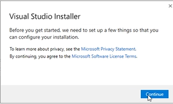
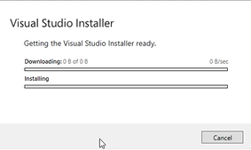
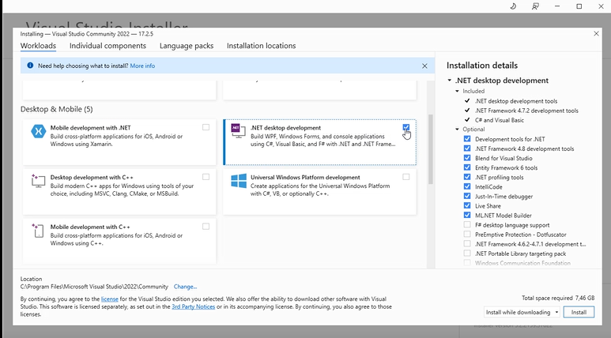
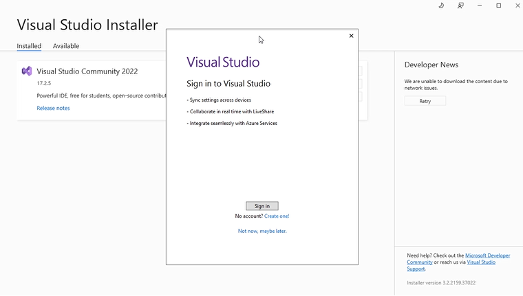
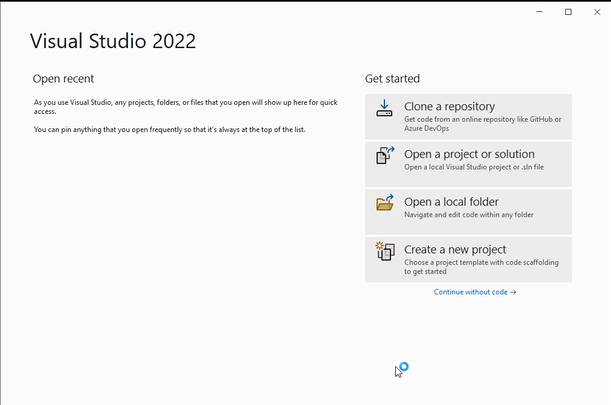

## visual studio installeren

> LET OP:  
>  
> dit is `niet` visual studio `code`!

- ga naar:
    - https://visualstudio.microsoft.com/vs/community/

- download installer
    - je krijg `VisualStudioSetup.exe` in je downloads

- start de installer
    - druk op `continue`
        > 
    - nu gaat de installer downloaden:
        > 

## Workload
- nu krijg je dit scherm te zien:
    > 
    - `vink` daar het onderstaande aan:
        - `.Net desktop development`
    - druk op `install`

## wachten

- wacht tot het klaar is:
    > 

## opstarten

- start nu visual studio op (als dat niet automatisch gaat)
    - je krijgt nu te zien:
    > 
    - kies `not now maybe later`
- daarna krijg je:
    > 

    - selecteer de `C#` keybindings en settings
        > deze hebben de `makkelijkste` shortkeys

## KLAAR!

- nu zie je de start wizard:
    > 