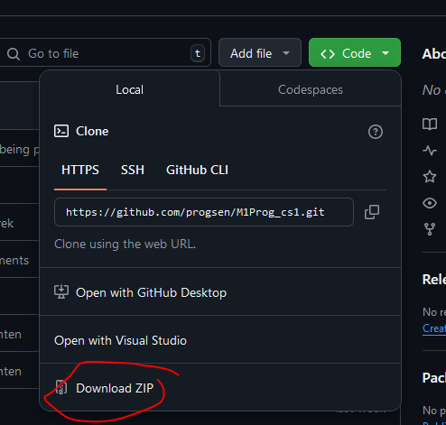

## tijd voor programmeer opdrachten

- lees deze uitleg: 
```
We gaan nu oefenen met C#, programmeren is vooral `DOEN`.
Hiervoor moeten we de opgaven naar onze laptop/computer krijgen

hoe doen we dat? Dat gaan we hieronder uitleggen en meteen doen!
```

#### Voorbereiden 

- ga naar:
    - https://github.com/progsen/M1Prog_cs1/tree/main
- click op de groene knop
    > 
- click op download zip
    > 

- pak de zip uit

#### Bestanden klaarzetten

- kopieer nu alle mappen vanaf 01 intro naar jouw schoolmap voor DIT vak
 - dat zou `M1Prog_cs1` moeten zijn

 #### Klaar

 nu staat alles klaar voor volgende opdrachten!