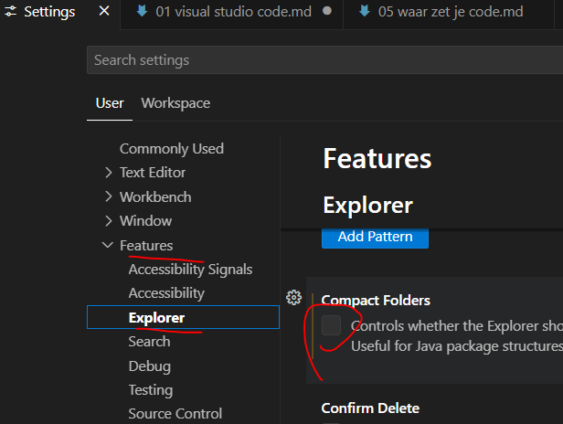

## Editor

- lees:
```
om te coderen hebben wij een texteditor nodig

- dit kan in alle programmas die tekst kunnen schrijven
- maar het is handiger om een code editor te gebruiken
```


## Visual Studio code
Ga naar:
- https://code.visualstudio.com/download

- installeer visual studio code

- start visual studio code op
    > wij noemen visual studio code ook vaak code


## instellingen

- open visual studio code
- open je preferences->settings
    - zit onder FILE of CODE
- zorg dat visual studio fullscreen is
    - open features->explorer
        - vink collapse folders uit
            > 