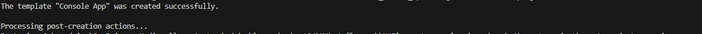

## startup

- maak een directory aan:
    - `M1Prog_cs1`
- zorg dat deze op een goede plek staat
    - het liefst bij je school werk
> Plekken die niet handig zijn:
> - je desktop
> - je gebruikers directory (c:\users\JOUWNAAM)


   
    
## ignore
- open je `M1Prog_cs1` directory in visual studio code
    - maak een `.gitignore` file 
        > tip gebruik visual studio code om een nieuwe file aan te maken
        - zet daar het volgende in:
```
**bin
**obj
**.vs
**packages
**/csproj.user
```
> !!! Let op dat er geen spaties en tabs voor de ** staan

- maak in die `M1Prog_cs1`  een nieuwe directory:
    - `00_start`
- maak in die directory een nieuwe directory:
    - `consoleproject`

## terminal openen met visual studio code

- kijk naar je explore window van visual studio code
    > 
    - rechter muis click op `consoleproject`
        - click op 'open in intergrated terminal'
            - je ziet nu een terminal, en je bent in de goede directory
                > 


## eerste project

- lees:
```
.net heeft veel verschillende project types, laten we met de meest simpele beginnen:
- het console project
dit is om even de commandline te leren kennen

```

- in je terminal in je `consoleproject` directory:
    - type `dotnet new console --use-program-main`
        > 


## draaien

- in je terminal type :
    - `dotnet build`
        > 
    - als er geen errors zijn:
        - type
            - `dotnet run`
                > 

## Aanpassen

- pas de "Hello, World!" zin aan naar een nieuwe welkomst boodschap
    > gebruik nette goede taal
    - zet er nu ook getallen bij
    - en gebruik wat leestekens of speciale tekens

## extra regel

- zet nu onder je Console.WriteLine... regel nog een regel met Console.WriteLine
    - laat hello world naar het scherm schrijven

## Build & test je applicatie

- controlleer of je ook je zinnen ziet:
    > 
