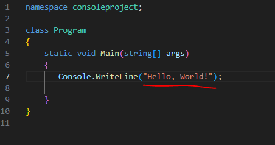

## start

- ga naar je `M1Prog_cs1` en dan naar directory:
    - `00_install_en_project`
- maak in die directory een nieuwe directory:
    - `codeplek`


## ignore
- open je `M1Prog_cs1` directory in visual studio code
    - open program.cs
        > 

## terminal openen met visual studio code

- kijk naar je explore window van visual studio code
    > 
    - rechter muis click op `codeplek`
        - click op 'open in intergrated terminal'
            - je ziet nu een terminal, en je bent in de goede directory

## tweede project

- in je terminal in je `consoleproject` directory:
    - type `dotnet new console --use-program-main`
        > 


## code op de verkeerde plek

- kopieer de Console.WriteLine en plak die op regel 2:
    > 
    - dotnet run en lees de fout.
- lees:
```
code kan je in 2 types opdelen:
- definities (variabelen bijvoorbeeld, en later ook classes en functions)
    - dit is de structuur van het programma en wat je gaat opslaan
- uitvoer code.
    - deze code draait als het programma draait

- elke van deze stukken code heeft zijn eigen plekje.
    - Console.WriteLine valt onder uitvoer code (het doet iets) en moet dus in de Main

```

- haal de code weg door het in commentaar te zetten:
    > 

- laten we nog een plek verkennen: 
    > 
- nu krijg je een invalid token in je fout

## herkennen

- lees:
```
als je veel fouten krijgt, invalid token ziet. of dingen zoals expected. dan weet je dat je een type fout hebt gemaakt (code technisch)
OF dat iets op de verkeerde plek staat

onthoudt dat!!!
- als je dit soort fouten tegenkomt kijk en bedenk goed of alles goed staat
```