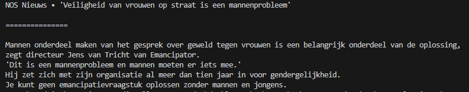

## start

- ga naar je `M1Prog_cs1` en dan naar directory:
    - `00_install_en_project`
- maak in die directory een nieuwe directory:
    - `verhaal`

## verhaal

- zoek een stuk tekst, dit mag uit een game, een quote, boek of verhaal zijn

- zet eerst op het scherm waar de tekst vandaan komt
- maak een witregel, of scheidings regel met een character zoals - of =
- gebruik nu de `console.writeline` constructie om het stuk tekst in meerdere regels op het scherm te zetten

- dit is mijn quote op het moment van schrijven:
    > 
