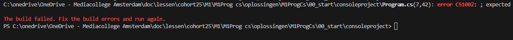

## Program.cs
   
    
## ignore
- open je `M1Prog_cs1` directory in visual studio code
    - open program.cs
        > 

- lees
    ```
    - zie je die "Hello, World!"?
        dat is een String waarde, dus een zin met letters
        Eigenlijk is dat een TIJDELIJKE variable

    - zie je op regel 1 de consoleproject?
        Dat is de namespace geworden. die komt dus vanwege de directory naam (consoleproject)
    ``` 

## fout maken

- haal de ; weg die achter ```Console.WriteLine``` staat
    - open je terminal in 00_consoleproject
        > vergeten hoe? lees de vorige opgaves
- in je terminal type :
    - `dotnet build`

- je krijgt iets als dit:
    > 

## fout lezen

- kijk goed naar de regel in het plaatje, zie je daar Program.cs(7,43) staan?
    - dat is in welke FILE, op welke REGEL en bij welke LETTER de fout begint
        - lees nu waar de fout bij jou zit in JOUW terminal
- kijk ook naar de error erachter
    - als je dat leest zie je:
        > ; expected
        - dat geeft de hint wat er fout is

- LEES dus altijd de fout, dan kom je snel bij waar het probleem zit

## fout fixen

- zet de ; weer terug
- type dotnet run in je terminal
    - zie je dat je nu BUILD en daarna het programma draait?
        > dotnet run is een makkelijke manier om je programma te bouwen en meteen te draaien, gebruik dat vanaf nu

