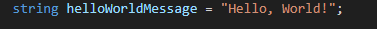
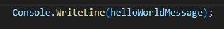

## Program.cs
   
    
## ignore
- open je `M1Prog_cs1` directory in visual studio code
    - open program.cs
        > 

## String

> de Hello, World! string gaan we nu naar een variable verhuizen (Refactoren)

- maak een nieuwe string variabel aan
    > 

- pas nu de console writeline aan:
    > 

## wat hebben we gedaan?

- lees
    ```
    als we een stuk code hebben zoals Console.WriteLine("hello"); dan zit daar een string waarde in:  
    - "hello" 

    Die waarde wordt als tijdelijke variable opgeslagen.

    1) Wij hebben nu een variable gemaakt en DAAR de waarde "hello world" in bewaart
    2) Later vragen wij de waarde van helloWorldMessage op, en gebruiken de waarde voor console.writeline
    ```


## + string

- laten we nu de code nog een keer aanpassen:
