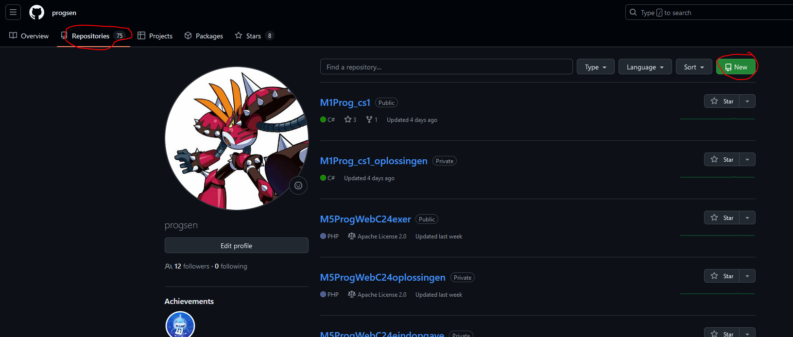
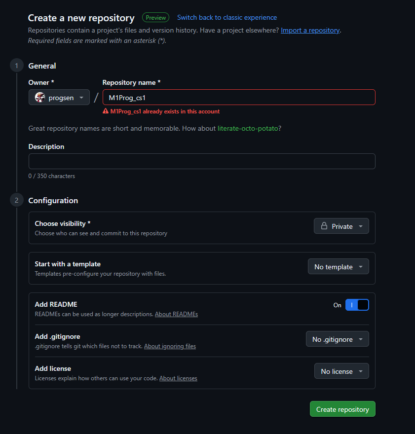

## git opzet

- lees
```
git is een systeem waarmee we kunnen bijhouden wat we gedaan hebben met onze code
- je kan zo ook terug gaan naar oude versies

```

## Git account

- lees:
    ``` 
    heb je al een github account voor school gemaakt in 1 van de andere lessen?
    ga dan naar het volgende kopje
    ```
- open deze link
    > https://github.com/signup
- gebruik je SCHOOL EMAIL!
- kies een goed wachtwoord en 
- maak een account aan
    >  lees alles goed en loop rustig door de stappen heen

## ons werk in git zetten.

- maak een `nieuwe` repository aan op github met de naam `M1Prog_cs1`, volg de stappen:
    > 

- vink aan:
    - private
    - add readme
        > 

- click op create
