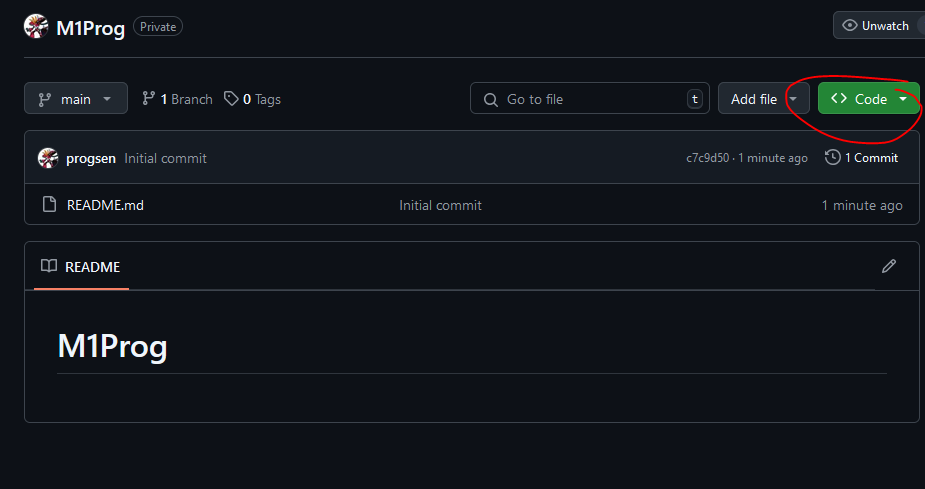
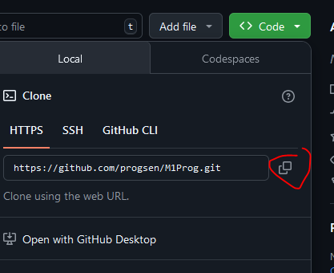

## Folder openen

- in visual studio code zoek je naar de optie om een folder te openen
    > HINT: FILE

- open je `M1Prog_cs1` folder
    > we noemen het soms ook directory of map


## terminal klaarzetten

- recht muis in je explorer sidebar
    - click op open in terminal
        > 

## naar je laptop

- ga naar je github in je browser

- click op de groene knop
    > 

- click op de copy knop
    > 

## clone 

- type het volgende in je terminal (druk NIET op enter)
    ```
    git clone
    ```
- plak de url erachter, dan krijg je zoiets:
    ```
    git clone https://github.com/progsen/M1Prog_cs1.git
    ```
- druk op enter


## check

- nu krijg je een extra folder
- kijk of daar de readme.md hebt staan die je door github hebt laten maken
