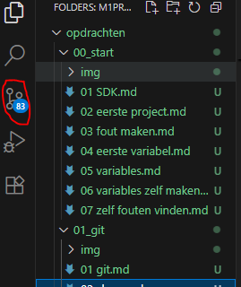
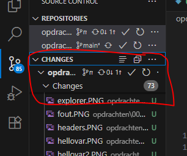
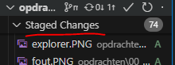
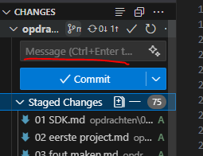
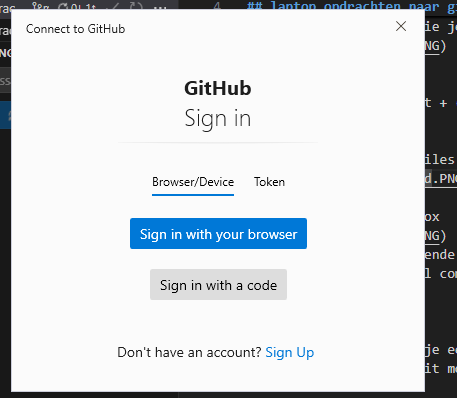
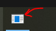
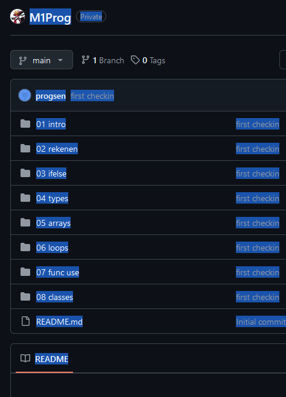

## laptop opdrachten naar github

- druk nu in visual studio code op de source control knop
    > 

- dan zie je de files die je veranderd hebt
    > 

## STAGE
- zoek in dit scherm het + (plusje) waarmee je de files aan de commit kan toevoegen

- + alle files
    - dan zie je alle files onder staged staan:
        > 

- zoek de message textbox
    > 
    - vul daar het volgende in:
        > m1prog initial commit

- click op commit
- click op sync
- waarschijnlijk krijg je een sign in venster
    > 
    - soms verstopt het venster zich, check je taakbalk!
        > 
    - zorg dat je authenticate en dat alles in github komt

    
## checken

- controlleer je github
    - kijk of je files er staan
    > (dit is een voorbeeld met andere files)  
    > 