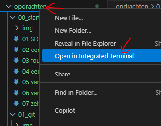

## startup

- maak een directory aan:
    - `M1Prog_cs1`
- zorg dat deze op een goede plek staat
    - het liefst bij je school werk
> Plekken die niet handig zijn:
> - je desktop
> - je gebruikers directory (c:\users\JOUWNAAM)


   
    
## ignore
- open je `M1Prog_cs1` directory in visual studio code
    - maak een `.gitignore` file 
        > tip gebruik visual studio code om een nieuwe file aan te maken
        - zet daar het volgende in:
```
**bin
**obj
**.vs
**packages
**/csproj.user
```
> !!! Let op dat er geen spaties en tabs voor de ** staan

- maak in die `M1Prog_cs1`  een nieuwe directory:
    - `00_consoleproject`

## terminal openen met visual studio code

- kijk naar je explore window van visual studio code
    > 
    - rechter muis click op `00_consoleproject`
        - click op 'open in intergrated terminal'
            - je ziet nu een terminal, en je bent in de goede directory
            > 


## eerste project

- lees:
    ```
    .net heeft veel verschillende project types, laten we met de meest simpele beginnen:
    - het console project
    dit is om even de commandline te leren kennen

    ```

- in je terminal in je `00_consoleproject` directory:
    - type `dotnet new console`
        > 


## draaien

- in je terminal type :
    - `dotnet build`

        > 
    - als er geen errors zijn:
        - type
            - `dotnet run`

                > 

## aanpassen & herhaling

- open Program.cs
    - maak 4 variabelen aan:
        - een int met een nummer
        - een string met een videogame character naam
        - een bool die op false staat
        - een float met een nummer (vergeet de f niet achter het nummer)
    - gebruik console writeline om:
        - de variabelen op het scherm te zetten

## build & run

- build je project
- run je project
- check!

    > 

## Klaar?

- git add .
- git status
    - staan de `bin` en `obj` er tussen?
        - dan is je `.gitignore` niet goed
            - `fix` dat!
- commit naar je repo voor dit vak
