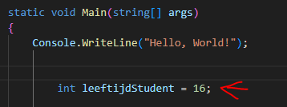
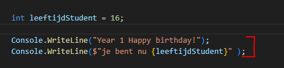
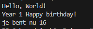
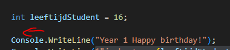
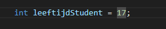
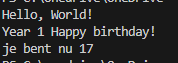

- maak in die `M1Prog_cs1`  een nieuwe directory:
    - `01_rekenen`
- maak in die directory een nieuwe directory:
    - `plus`

## terminal openen met visual studio code

    - rechter muis click op `plus`
        - click op 'open in intergrated terminal'
            - je ziet nu een terminal


- in je terminal in je `plus` directory:
    - type `dotnet new console --use-program-main`
        > 

## plus

- open je Program.cs
- maak een variabele voor leeftijd
    > 

- zorg dat je leeftijd op het scherm komt:
    > 
- run en test even of het werkt
    > 

## begrijpen

- lees:
    ```
    hier hebben we een nieuw stukje met strings:
    - $"je bent nu {leeftijdStudent}"
    1) wat hier gebreurt is dat we met het dollar teken $ aangeven dat we variabelen in de string willen kunnen zetten
    2) met {} geven we aan dat we daar wat willen invullen
    3) tussen de {} zetten we dan bijvoorbeeld een variable om om te zetten naar string en in de string te plakken 
    ```

## +1 jaar

- we zetten nu BOVEN de console writeline een berekening die leeftijdStudent aanpast:
    > 
- lees het patroon hieronder:
    ```csharp

    int nummerVariable=0; //we starten op 0

    // we rekenen tellen 0 + 1 uit, EN DAN zetten we het resultaat (1) in nummervariable met de = 
    nummerVariabel = nummerVariabel + 1;

    ```

- gebruik het patroon om jezelf een jaartje ouder te maken
    > gebruik de leeftijdStudent variable 
    > - dit mag niet!  
    > 
    
- run en check:

    > 