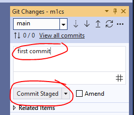

## git opzet

> - wij gaan nu ons werk in git zetten.
- maak een `nieuwe` repository aan op github met de naam `M1Prog_cs1`, volg de stappen:

> 

- vink aan:
    - private
    - add readme
> 

- click op create

## naar je laptop

- click op de groene knop
> 

- click op de copy knop
    > 
- open visual studio 2022,
    - click op clone
> 
- plak de url 
- en selecteer je  ma/.../M1Prog directory
> 
- click op clone

## vullen

- zet de opdrachten nu in die folder
    > 
- ga naar git changes 
    > 

## commit

- nu zie je zo iets:
    > 
- click op de +
    > 

- vul een message in bv: 
    - first checking
- click op commit
    > 
- daarna op spushync
    > 
    
## checken

- controlleer je git
    > 