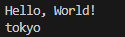

## start

- ga naar je deze directory in je terminal van visual studio code:
    - `02_var`
- maak in die directory een nieuwe directory:
    - `variableopdracht1`
        > 
    

## terminal openen met visual studio code

- kijk naar je explore window van visual studio code
    - rechter muis click op `variableopdracht1`
        - click op 'open in intergrated terminal'
            - je ziet nu een terminal, controlleer of je in de goede directory zit


## dotnet new

- in je terminal in je `variableopdracht1` directory:
    - type `dotnet new console --use-program-main`
        > 
- open Program.cs
 
 ## variablen maken
- kijk waar Hello World staat
- zet tussen hello wolrd en VOOR de `}` wat nieuwe lege regels:
    > 

- daar maak je:
    - 4 variabelen voor een vlucht:
        > 
    
    - sluit deze allemaal af met een ; zonder er een waarde aan te geven

- build je project
- run je project
- werkt het? als het goed is wel, alleen je ziet alleen Hello world op het scherm, dat is goed!

## begrijpen

- lees:
```
Zie je dat we variabelen maken door eerst het TYPE en daarna de naam te typen?  

We gebruiken hier 4 verschillende types:
- string, voor waardes die letters, tekens en nummers KUNNEN bevatten
    > bv: "Hello! user7923#$"
- int, dit is voor waardes van HELE getallen, hiermee kunnen we rekenen
    > bv: 999, maar NIET "999" dat wordt een string
- double, ook voor getallen, maar dan met een komma
    > bv: 15.99
- bool: voor het bijhouden of iets waar of niet waar is, of aan of uit staat
    > je kan alleen true OF false als waardes gebruiken
```

## Variabelen op het scherm zetten

- we gaan nu de variabelen ook waardes geven:
    > 

- zet nu er extra code bij om het op het scherm te zetten:
    > 

- run!
    > 

- zet nu de rest ook op het scherm:
    > HINT: je hebt 4 writeline regels nodig!  
    > 
    

## mooier

- probeer nu zelf dit te maken:
    > 

- kijk naar de code en probeer dit te begrijpen:
    - zie je hoe we waardes, variablen en strings aan elkaar plakken zodat 1 string wordt?


# Zelf oefenen

##  Fietsregistratie

- onder de vlucht variabelen, zetten we even een regel commentaar:
    ```csharp
    //fiets:
    ```
- daaronder maken we de kenmerken van een fiets:
    > string merk  
    > int versnellingen  
    > double framemaat  
    > bool heeftBel  

        
- build je project
- run je project
- check!

## Video game character:
    - maak 4 variabelen aan:
        - een int met een nummer
        - een string met een videogame character naam
        - een bool die op false staat
        - een float met een nummer (vergeet de f niet achter het nummer)
    - gebruik console writeline om:
        - de variabelen op het scherm te zetten

## 

        
- build je project
- run je project
- check!

## Klaar?

- git add .
- git status
    - staan de `bin` en `obj` er tussen?
        - dan is je `.gitignore` niet goed
            - `fix` dat!
- commit naar je repo voor dit vak
