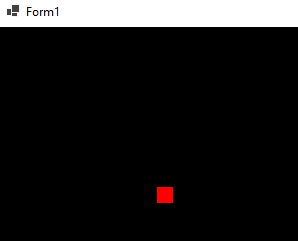

## MovePlayerLoop

- open MovePlayerLoop.sln

- lees:
```
We gaan nu met een ifelse ervoor zorgen dat de speler niet uit het scherm loopt
```
## 0)

- zorg dat deze werkt zoals MovePlayer.sln van de opdracht `03 MovePlayer` 
    - kopieer de code van Form1.cs uit `03 MovePlayer` 
        - let op dat de namespace in de file `namespace MovePlayerLoop` is en niet `namespace MovePlayer`

## 1)

- open `Form1.cs`
- ga naar `internal void DoLogic(float frametime)`
    - zet nu een if erbij:
        - ALS de player.x KLEINER DAN 0 zet die dan op ClientSize.Width
- Lees:
```
ClientSize is hoe groot het window is, deze heeft ook een Height
```

- zorg ervoor dat je nu zowel:
    - onder
    - boven
    - links
    - rechts
    - het scherm uit kan lopen en aan de andere kant weer terug komt

## testen

- start de applicatie op
- je ziet nu dit:
> 
- druk op de W,S,A,D toetsen en beweeg de speler
    - de speler beweegt en loopt als de speler het scherm uit loopt
    > 

## klaar

- commit & push naar je github        