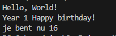
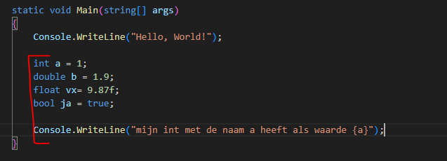
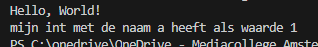
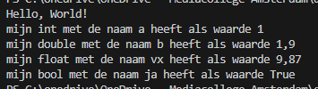

## begrijpen

- in de vorige les hadden we dit stuk code:
    > 
- lees:
    ```
    hier hebben we een nieuw stukje met strings:
    - $"je bent nu {leeftijdStudent}"
    1) wat hier gebreurt is dat we met het dollar teken $ aangeven dat we variabelen in de string willen kunnen zetten
    2) met {} geven we aan dat we daar wat willen invullen
    3) tussen de {} zetten we dan bijvoorbeeld een variable om om te zetten naar string en in de string te plakken 
    ```

## oefenen

- ga naar je deze directory in je terminal van visual studio code::
    - `03_rekenen`
- maak in die directory een nieuwe directory:
    - `output`

## terminal openen met visual studio code

    - rechter muis click op `plus`
        - click op 'open in intergrated terminal'
            - je ziet nu een terminal


- in je terminal in je `plus` directory:
    - type `dotnet new console --use-program-main`


## oefen variablen

- maak dit na:
    > 

- bedenk: wat moet op het scherm komen?
- test het programma
    - klopt dit? wat we willen is dit:
        > 
    
## verbeter

- kijk nog eens naar deze code:
    > 
    - wat is het verschil met onze code?
        - pas het aan en TEST!


## de rest

- zet de rest ook op het scherm:
    > 


## 2 keer een {}

- maak nu zelf een zin erbij die 2 variabelen in een string zet en op het scherm toont


#### GIT

als je een opdracht af hebt:
- commit naar je github voor dit vak!
    > (commit & push), zie de `03 commit.md` oefening
