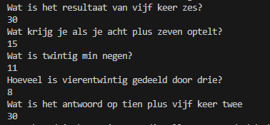

## start

- maak in die `M1Prog_cs1`  een nieuwe directory:
    - `01_rekenen`
- maak in die directory een nieuwe directory:
    - `sommen`
- maak een nieuw dotnet project aan

## rekenen met code

- gebruik nu de rekenen operators (*, +, /, -) om de volgende sommen te maken:

    - Wat is het resultaat van vijf keer zes?
    - Wat krijg je als je acht plus zeven optelt?
    - Wat is het verschil tussen twintig min negen?
    - Hoeveel is vierentwintig gedeeld door drie?
    - Wat is het antwoord op tien plus vijf keer twee
        > Let op: volgorde van bewerkingen telt hier!

- zet ook de zinnen hierboven op het scherm

## Check

- controlleer je antwoorden:
    > 
    
## Klaar?

- git add .
- git status
    - staan de `bin` en `obj` er tussen?
        - dan is je `.gitignore` niet goed
            - `fix` dat!
- commit naar je repo voor dit vak
