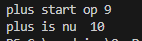
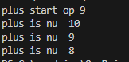
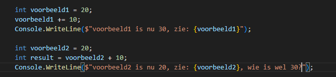
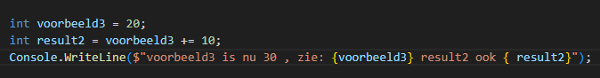

## start

- maak in die `M1Prog_cs1`  een nieuwe directory:
    - `01_rekenen`
- maak in die directory een nieuwe directory:
    - `operators`
- maak een nieuw dotnet project aan

## ++ en --

- zoek op het internet wat ++ en -- doen
    > zonder AI dan onthoudt je het beter, dus gebruik een normale zoekmachine

- maak nu een nieuwe variabel van het type `int`
    - noem deze plus
    - geef die de waarde 9
        - zet een nieuwe regel met enter
        - tel er 1 bij op met ++


- zet elke stap op het scherm:
    > 

## Uitleg

- lees

```

Een variabel van het type int, start op waarde 0.
TENZIJ wij dat anders aangeven

- in het geheugen is 0 bewaard, of met onze opdracht 9, 
    - dat geheugen heet nu plus, die naam hebben WIJ gekozen
- met ++ doen we het volgende
    - stap 1) we pakken de waarde van plus uit het geheugen dat is dus 9
    - stap 2) we tellen er 1 bij DIE waarde op, dus 10
    - stap 3) nu bewaren we de 10 in het geheugen waar eerst 9 stond, wat dus plus heet

```

## min min

- haal nu er 2 van af.
    - doe dit met 2 regels code en de --

## Test

- zorg dat je dit krijgt:
    > 

## plus is

- lees:
```
we hebben nog meer operators die zo werken:
1) += 1;
2) -= 1;
3) /= 1;
4) *= 1;

Maar deze zijn anders dan -- en ++ WANT je kan de 1 invullen

je kan dus ook +=10, om 10 bij de variabel op te tellen
```

- maak het volgende na:
    > 

- bedenk zelf:
    - waarom is voorbeeld2 niet 30 terwijl we er 10 bij optellen?
        - wie is wel 30?
        - welke stap slaat ```voorbeeld2 + 10;``` over?

- probeer nu deze code:
    > 
    - bedenk wat het verschil is en WAAROM dit zo werkt

## zelf

- maak nu zelf:
    - een int met een waarde
        - haal daar een getal af met -=
        - zet het resultaat op het scherm

        
    - een double met een waarde
        - doe die keer een getal met *=
        - zet het resultaat op het scherm

    - een float met een waarde
        - deel die door een getal met /=
        - zet het resultaat op het scherm
## Klaar?

- git add .
- git status
    - staan de `bin` en `obj` er tussen?
        - dan is je `.gitignore` niet goed
            - `fix` dat!
- commit naar je repo voor dit vak
