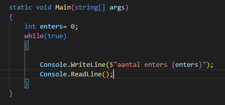
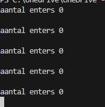
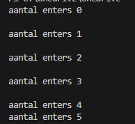

## start


- maak in die `M1Prog_cs1`  een nieuwe directory:
    - `03_rekenen`
- maak in die directory een nieuwe directory:
    - `enterplus`
- maak een nieuw dotnet project aan

## rekenen met code

- zet daar deze code in
    > 

## TEST

- controlleer of het werkt
    > dit programma blijft doorgaan totdat je het sluit, dit wordt later uitgelegd
    - druk meerder keren op enter
        > 
- stop het programma door op ctrl-c (in de terminal) te drukken
## opdracht

- lees:
    ```

    de opdracht:
    nu willen we dat elke keer als je op enter drukt er 1 bij enters wordt opgetelt

    ```

- maak het programma af volgens de opdracht hierboven


## TEST

- controlleer je resultaat
    > 


## Klaar?

- git add .
- commit naar je repo voor dit vak
