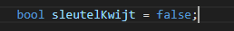
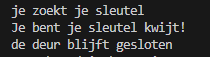

## start

- maak in die `M1Prog_cs1`  een nieuwe directory:
    - `04_beslissen`
- maak in die directory een nieuwe directory:
    - `als`

## beslissingen maken

- lees:

```
programma's bestaan in de basis vaak uit
- dingen bijhouden (geheugen en variabelen)
- rekenen
- input lezen (text, keyboard, muis etc)
- beslissingen maken op basis van de variablen of input

om dingen te beslissen gebruiken we de if statement
wat daar uit komt is een boolean, Waar (true) of Niet (false) waar 
```

- we beginnen met het maken van een nieuwe variabel van het type boolean:
    > 
    - bedenk wat zouden we hier mee op het scherm kunnen zetten?
        - en wat als de sleutel wel kwijt is?

## deurtje

- we beginnen eenvoudig lees deze specificatie:
    ```
    1) als het programma begint zet het het volgende op het scherm
        - je zoekt je sleutel
    2) het programma moet het volgende op het scherm zetten als de sleutel kwijt is:
        - Je bent je sleutel kwijt!
        - de deur blijft gesloten
    ```

- zet eerst de sleutel even op kwijt
    > gebruik true
- gebruik 1 if om dat te maken gebruik de template hieronder
```CSharp
if(...)//vervang de ... met iets wat met de sleutel te maken heeft
{
    //console hier
}
```

## Test

- test je programma en verbeter totdat je dit hebt:
    > 


## niet kwijt

- test nu je programma ook met niet kwijt
    - werkt dat ook goed?
    > LET OP, voor een programmeur is het SUPER belangrijk om te testen
    > als je je programma niet werkend oplevert is professioneel niet verantwoord

## Klaar?

- git add .
- commit naar je repo voor dit vak
