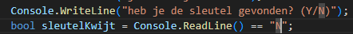
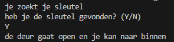
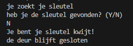

## start

- open je programma van `01 if.md`

## als of anders

- lees:
    ```
    vaak als je iets doet, kan het ook zijn dat als dat niet gebeurt je iets anders wil doen

    dit kan in code, we kennen de if. Nu krijgen we de else erbij.


    bijvoorbeeld:
    - als je sleutelKwijt is, zetten we dat op het scherm
    - ZO niet (ANDERS) zetten we op het scherm: je gaat naar binnen
    ```


## Variabele input

- gebruik nu deze code om je sleutelKwijt te vullen:
    > 

- lees:
    ```
    == is een vergelijking. 
    - dit betekent is wat links van == staat gelijk aan rechts
        > bijvoorbeeld 0 == 0 (is 0 gelijk aan 0), dat klopt dus dat is waar
    - het resultaat van == is true of false.

        > 5 == 3+2, dat is  5 == 5 en is dus waar => true
        > 1 == 4, is niet waar daar komt dus false uit

    - Console.ReadLine() == "N" vergelijkt wat JIJ typed met de string N
        - dus als jij N typed is het WAAR (en ben je je sleutel kwijt)
        - anders niet, dus ook n is NIET WAAR

    ```

## aanpassen

- pas het programma aan zodat:
    - het programma reageert op zowel je sleutel kwijt als niet kwijt
    - als je je sleutel niet kwijt bent dan laat het programma het volgende zien:
        > de deur gaat open en je kan naar binnen

- gebruik deze template:
    ```csharp
    if(...)
    {
        
    }
    else
    {
        
    }

    ```

- lees:
    ```
    zie je dat de else geen haakjes heeft?
    de haakjes horen bij de if
    ```

## Test

- test je programma en verbeter totdat je dit hebt:
    - sleutel niet kwijt:
        > 
    - sleutel wel kwijt:
        > 

## Klaar?

- git add .
- commit naar je repo voor dit vak
