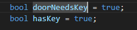
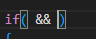
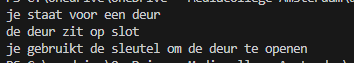
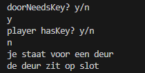
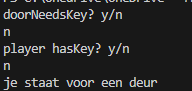
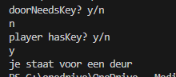
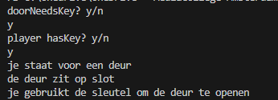

## start

- maak in die `M1Prog_cs1`  een nieuwe directory:
    - `04_beslissen`
- maak in die directory een nieuwe directory:
    - `en`

## &&

- lees
    ```
    - de && operator kijkt naar 2 booleans, en wordt:
        - waar als beide true zijn
        - false in alle andere gevallen
        - dus beide MOET waar zijn
    ```


## program start

- zet deze variabelen in het programma:
    > 

- zorg dat het programma het volgende op het scherm zet:
    > je staat voor een deur
- gebruik de if template

- tussen de haken zet je de &&:
    > 

- links en rechts zet je de booleans, dan check je of de deur dicht is en of je een sleutel hebt
    - als alles true is zet je dit op het scherm:
    >je gebruikt de sleutel om de deur te openen
- zorg ook dat je als de deur een sleutel nodig heeft je het volgende op het scherm zet:
    > de deur zit op slot

## test:

- run het programma en check of je dit krijgt:
    > 

## uitbreiden

- zorg dat je de booleans kan aanpassen, gebruik Console.ReadLine

- test alle mogelijkheden van true/false
    - true/false
        > 
    - false/false
        > 
    - false/true
        > 
    - true/true
        > 

## || OF

- lees:
```

- || werkt zoals de && maar volgens iets andere regels:
    - ALS links of rechts true is DAN is het resultaat true
        > false || true => true
        > true || false => true
    - als beide waar zijn, DAN true
        > true || true => true
    - als beide false zijn dan false 
        > false || false => false
```

## project

- maak in die `M1Prog_cs1`  een nieuwe directory:
    - `04_beslissen`
- maak in die directory een nieuwe directory:
    - `of`

## programma


## Klaar?

- git add .
- commit naar je repo voor dit vak
