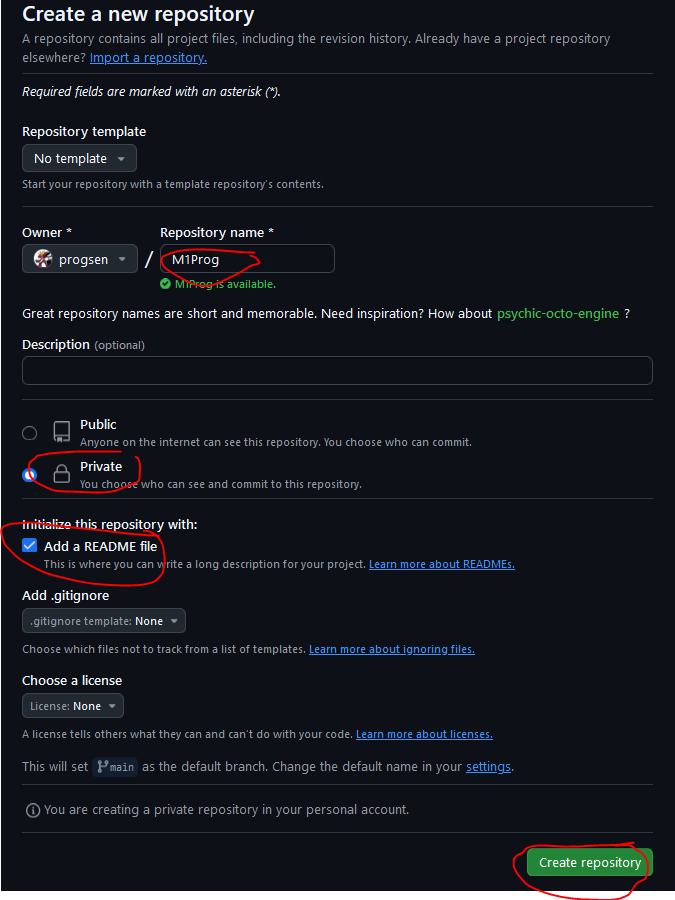
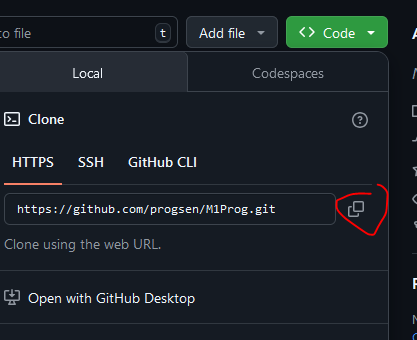
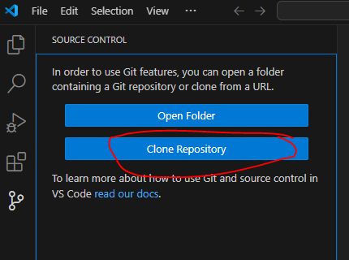
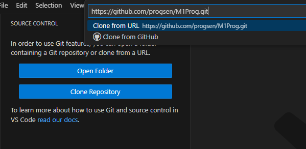
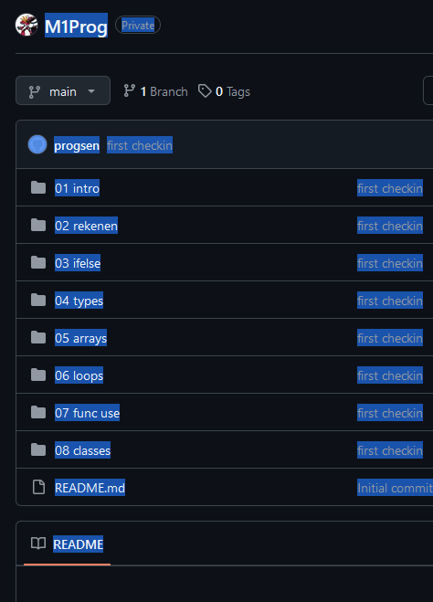

## git opzet

> - wij gaan nu ons werk in git zetten.
- maak een `nieuwe` repository aan op github met de naam `M1Prog_cs1`, volg de stappen:

> 

- vink aan:
    - private
    - add readme
> 

- click op create

## naar je laptop

- click op de groene knop
> 

- click op de copy knop
    > 
- open visual studio code, en ga naar source control 

    > 
    - hint:
    > zorg dat alles gesloten is en je geen folder geopend hebt!

- click op clone
> 
- plak de url
> 

- selecteer je  ma/.../M1Prog directory

- visual studio gaat clone, laat visual studio het openen

## vullen

- zet de opdrachten nu in die folder
    > 
- ga naar source control
    > 

## commit

- nu zie je zo iets:
    > 
- click op de +
- vul een message in bv: 
    - first checking
- click op commit
- daarna op sync
    > 
    
## checken

- controlleer je git
    > 