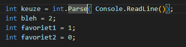

## start

- ga naar je deze directory in je terminal van visual studio code::
    - `04_beslissen`
- maak in die directory een nieuwe directory:
    - `of`

## || OF

- lees:
```

- || werkt zoals de && maar volgens iets andere regels:
    - ALS links of rechts true is DAN is het resultaat true
        > false || true => true
        > true || false => true
    - als beide waar zijn, DAN true
        > true || true => true
    - als beide false zijn dan false 
        > false || false => false
```

## programma

- lees deze specificaties
```

in dit programma zit een kleine virtuel huisdier
het huisdier heeft een voorkeur voor 2 types fruit
en een afkeur voor 1 type fruit

als het dier zijn favoriet te eten krijgt zet je het volgende op het scherm:
- JUM JUM

bij de afkeur zet je op het scherm:
- BLEH!

```
- kies 3 stukken fruit en geef die een nummer van 0 tot en met 2
- zet de fruit stukken als keuzes op het scherm

- gebruik daarna deze code:
    - dit is voor het kiezen en voor welke soorten
    - en variabelen voor de favorieten en de bleh keuzes
        > 

- maak nu het programma af aan de hand van de specificaties, gebruik een if en een else


## Klaar?

- git add .
- commit naar je repo voor dit vak
