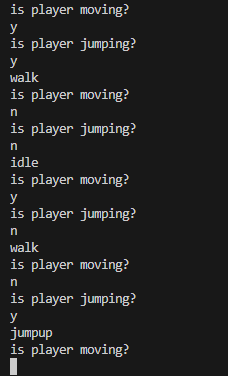

    
## start

- ga naar je deze directory in je terminal van visual studio code::
    - `04_beslissen`
- maak in die directory een nieuwe directory:
    - `alsdan`

## else if

- lees
```

soms heb je meerdere acties gebaseerd op 1 input
- bijvoorbeeld:
    - animaties in een spel
        - als de speler beweegt dan speel walk af
        - als de speler springt dan speel jumpup af
        - als de speler beweegt en springt dan speel jump af
        - anders (als de speler stilstaat), dan speel idle af

dit kan met een uitgebreiderde if:

if(...)
{

}
else if(...)
{

}
else
{

}

zie je dat de laatste else geen haakjes heeft?
de haakjes horen bij de if
```

- maak het programma met animaties.
    - gebruik een boolean variabel voor of de speler springt
    - gebruik een boolean variabel voor of de speler loopt/beweegt
    - zet de animatie op het scherm als string


## test

- zorg dat je alle opties test
    - als je zelf de variabelen kan veranderen (met console readline) dan test het makkelijker
        > 


## virtual pet

- open je of oefening met het virtuele huisdier
- breidt het programma uit met:
    - 2 extra stukken fruit
    - die kan het dier eten
    - als je die voert zegt het dier:
        > CHOMP
    - je hebt dus een extra else if nodig

## Klaar?

- git add .
- commit naar je repo voor dit vak
