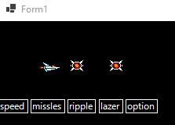
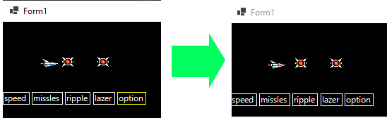

## SelectYourPower

> we gaan nu een array van powerups gebruiken en daar een cursor over laten lopen

- open de solution `SelectYourPower.sln`

- lees deze uitleg:
    - dit is waar we naar toe werken:
    > 
    - de speed, missles, ripple, lazer en option, zijn powerups
        - elke keer als het ship door een powerup geraakt wordt:
            - gaat het gele vak 1 hokje verder
        - als je op spatie drukt:
            - dan gebruik je al je power

## 1)
- open `Form1.cs`
- zoek:
    - // 1)
        - reset de waarde van de powerCount variable naar: -1

## 2)
- open `Form1.cs`
- zoek:
    - //2) 
        - tel 1 bij de powerCount op ;

## 3)
- open `Form1.cs`
- zoek:
    - //3)  
        - check of de powerCount waarde groter is dan de powerups lengte min 1
## 4)
- open `Form1.cs`
- zoek:
    - //4)  
        - maak de code af:
            - zorg dat je de huidige powerUp string pakt uit powerUps, gebruik i

## 5)
- open `Form1.cs`
- zoek:
    - //5) 
        - maak de code af:
            - zorg dat je de huidige pickup Square pakt uit pickups, gebruik i

## testen

- start de applicatie op
- je ziet nu dit:
> 

- wacht tot de speler wat powerups gepakt heeft
> 

- druk op spatie
    - de powercount reset naar -1
        - de gele rechthoek verdwijnt
        > 

## klaar

- commit & push naar je github        