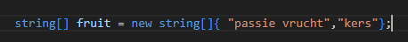
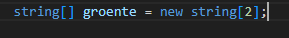

## start 


- maak in de `M1Prog_cs1`  een nieuwe directory:
    - `05_collecties`
- maak in die directory een nieuwe directory:
    - `fruit`

## fruit collectie


- lees:
```

als je een lijstje van dingen met bijhouden, bijvoorbeeld welk fruit je in huis hebt, dan gebruik je vaak een array

een array is een lijst van variabelen, die achter elkaar in het geheugen staan

- zodra je een array of lijst ( ook wel collectie genoemd) hebt kan je heel makkelijk met alle dingen in die lijst werken
    - je kan ze eenvoudig op het scherm zetten
    - heb je nummers bewaard? dan kan je dezelfde berekening heel makkelijk over alle getallen uitvoeren


```

- laten wij een lijst van fruit maken, we gebruiken het type string:
    > 

- run het programma, als het goed is zie je nog niets op het scherm

- bekijk de code:
    - zie je dat we 2 stukken fruit erin hebben zitten?
    - zie je dat we aan beide kanten van de = string[] hebben staan?
        - lees:
            ```
            dat is het type van de array
            wij zeggen hiermee wij willen een lijst `[]` waar wij `string` variabelen in bewaren
            ``` 

## lege array

- lees:
```

soms heb je een lijstje/collectie nodig voor later.
- je stopt er later dingen in

dat kan je ook in code zetten. maar dan geef je aan hoe groot de lijst mag zijn
```

- onder je fruit zet je het volgende neer:
    > 

## andere types

- lees:
```
wat als je wat anders wil bewaren? 
dan verander je het type!


voorbeeld: 
=====
> je gaat nummers bewaren dan heb je een int nodig
in plaats van string[] schrijf je dan int[]
```

- maak nu een int array en noem die:
    - geluksgetallen
    - zorg dat er 3 getallen van onder de 10 in staan

- maak ook een int array van 10 lang en noem deze:
    - totTien

## float en bool

- maak nog 2 arrays:
    - 1 waar booleans in kunnen
    - 1 waar floats in kunnen

## Klaar?

- git add .
- commit naar je repo voor dit vak
