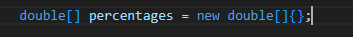
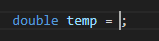
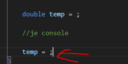
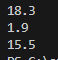

    
## start

- ga naar je deze directory in je terminal van visual studio code::
    - `05_collecties`
- maak in die directory een nieuwe directory:
    - `uitvragen`

## array maken

- maak nu een array van het type double:
    > 

- hoeveel items (dingen) heeft deze array nu?

- zorg dat er 5 in staan
    > het moeten doubles zijn, dus getallen met een . zoals 0.5

## uit het geheugen opvragen

- lees:

    ```
    hoe vragen we dingen op uit het geheugen?
    met een variable:
    int leeftijd = 9;

    typen we gewoon de naam, dus leeftijd

    leeftijd

    dan wordt dat 'vervangen' door de waarde, in dit geval 9

    een array is een lijst aan variabelen, dat werkt BIJNA op dezelfde manier

    voorbeeld:
    int[] leeftijden = new int[] {15,16,17};

    je schrijft eerst de naam van de array:
    leeftijden

    nu ben je met de array bezig, niet met de waardes (int variabelen) daarin
    dus je hebt nog 1 stap nodig:
    je moet kiezen welke waarde je wil.

    maar hoe?

    in het geheugen staat het zo:

    |15|16|17|  dus achter elkaar

    15 is de eerste, en die tellen we als 0

    16 is de tweede, die tellen we als 1, want dat is het geheugen adres van de eerste PLUS de groote van een INT in bytes keer 1. Voor 17 is dat dus *2

    laten we 17 pakken:

    leeftijden[2] (want item 3, is dus de tweede NA 15 pakken)
    ```

## zelf proberen

- maak een nieuwe variabel:    
    > 

- zet achter de = nu de naam van onze double[].
- pak nu het 4de getal, dat wordt dus de derde (3) na de eerste

- gebruik console.writeline om temp op het scherm te zetten

- lees:
    ```
    we gebruiken hier een tijdelijke variable
    - waarom is deze tijdelijk? dat heeft te maken met scope, niet met de naam
        - een variable die tijdelijk heet, kan nog steeds niet tijdelijk zijn
    - we maken dus even een nieuwe variable om even tijdelijk iets mee te doen (rekenen, bewaren etc)
        - en daarna hebben we die niet meer nodig
        
    ```
## volgende

- we pakken nu de volgende, we gebruiken temp nog een keer
    > 

- zoek even uit waarom we niet weer double ervoor zetten
    - wat doen we hier nou precies in dit stuk code?

- pak nu het 2de getal

## nog eentje dan

- doe hetzelfde voor het 3de getal

- test je programma
    - dit is wat ik kreeg met mijn nummers
    > 

## Klaar?

- git add .
- commit naar je repo voor dit vak
