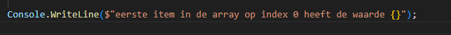
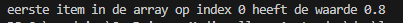
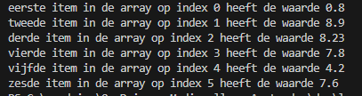

    
## start

- ga naar je deze directory in je terminal van visual studio code::
    - `05_collecties`
- maak in die directory een nieuwe directory:
    - `direct`

## array maken

- maak nu weer array van het type double:
    > 
- zet er 6 variabelen in

- lees:
```
even ter herhaling:
om bij de waarde van een variable in een array te komen zetten we bijvoorbeel [0] achter de naam van de array:

char[] letters = new char[]{'a','b','c'};
letters[0]; //dit wordt dan de 'a'
```

## direct op het scherm

- gebruik dit code voorbeeld:
    > 
- zet tussen de '{}' de naam van de array, en pak dan het eerste item:
    > ik heb als eerste getal  0.80 dan krijg je:
    > 

- zet nu alle 6 items op het scherm op dezelfde manier, vergeet niet de index en de noemer aan te passen!
    > 

- lees:
```
dit is best veel werk, en we kunnen dit veel slimmer doen, maar dat komt in een van de volgende lessen
- nu moeten we even GOED weten:
    - wat het verschil is tussen
        - de array als variable (int[] leeftijd = ...)
        - en de variable die IN de array zit (leeftijd[0], of leeftijd[2] etc)
    - HOE we bij de waardes van de variabel IN de array komen
    - DAT de waarde van een array een LIJST aan variabelen is
    - waar [] gebruikt wordt en waarom
```
## Klaar?

- git add .
- commit naar je repo voor dit vak
