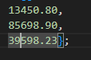
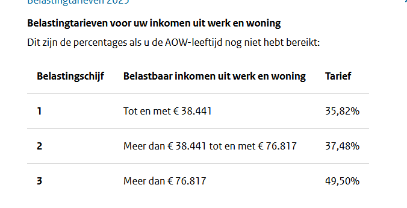
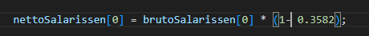
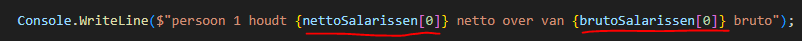
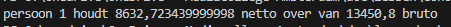
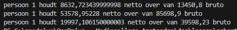

    
## start

- ga naar je deze directory in je terminal van visual studio code::
    - `05_collecties`
- maak in die directory een nieuwe directory:
    - `direct`
    > 

## array maken

- we maken nu 1 array:
    - een double array met de naam brutoSalarissen
    - zet er deze waardes in:
        > 
    
- we maken nu 2de array:
    - een double array met de naam nettoSalarissen
    - geef deze de lengte 3, maar stop er geen waardes in


## belasting
- bekijk deze belasting tarieven:
    > 

- lees:
    ```
    - belasting uitrekenen is lastiger dan we het nu gaan doen
    - wij nemen alleen even het percentage van de schijf, wat dus niet klopt na de eerste schijf!

    ```

## uitrekenen
- we gaan nu rekenen:
    > 
    - lees de code goed!! 
        - snap je wat we hier doen? we rekenen het overgebleven stuk van de 1ste belastingschijf uit

- schrijf het nettoSalaris van de eerste persoon naar het scherm:
    > 

    > 

## direct
- lees:
    ```
    - we halen dus met brutoSalarissen[0] direct de waarde op en gaan er direct mee rekenen
    - daarna slaan we het resultaat op in nettoSalarissen[0] op
    - en we gebruiken de waardes direct in de string die we op het scherm tonen
    ```

- reken nu de rest zelf uit!
    > 

## Klaar?

- git add .
- commit naar je repo voor dit vak
