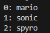
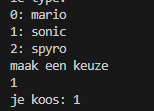
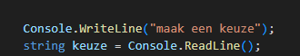
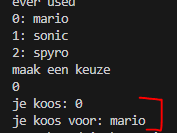

    
## start

- ga naar je deze directory in je terminal van visual studio code::
    - `05_collecties`
- maak in die directory een nieuwe directory:
    - `varindex`

## array maken

- maak een array van het type string:
- zet daar de volgende string in:
    - mario
    - sonic
    - spyro

- zet die allemaal met de index op het scherm:
    > 

## kiezen

- zorg nu dat je een keuze kan invoeren, zet de keuze op het scherm
    - vang de keuze uit readline op in een string variable met naam keuze
    > het character uit de array halen komt later  
    > 
    
- maak een nieuwe variable:
    - van het type int, met de naam gekozenIndex

- zorg dat de keuze die in de string staat een int wordt:
    - er zijn twee manieren:
        - gebruik je if else
        - zoek uit hoe je een string naar een int veranderd

## gekozen character

- we gaan nu het gekozen character pakken gebruik deze code:
    > 
- zet de keuze op het scherm!
    - test je programma:
        > 

## Klaar?

- git add .
- commit naar je repo voor dit vak
