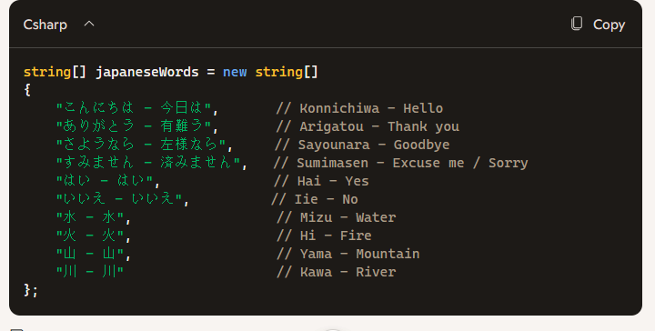

    
## start

- ga naar je deze directory in je terminal van visual studio code::
    - `05_collecties`
- maak in die directory een nieuwe directory:
    - `ialsindex`

## array maken

- maak een array van het type string:
    - gebruik AI of een search om 10 veel gebruikte woorden van een taal te generen, als c# string[]
        > 
    - zet dat in je code

## AI

- lees:
    ```
    AI is een mooie tool, maar ook een manier om HEEL slecht te leren.
    - als je AI goed inzet (met de basis kennis ZELF op orde te hebben) dan kan het je helpen
    - waarom mag je hier ineens AI gebruiken?
        - het is NIET belangrijk om zelf inhoudt te verzinnen voor leren programmeren toch?
        - wat is wel belangrijk?
            - weten hoe arrays werken, wat je ermee kan, en het zelf kunnen maken en toepassen

    ==Voorbeeld:==
    - ik gebruik een AI vaak voor content, zoals tekst lijstjes, of business case voorbeelden
    - bijna nooit voor code generatie:
        - tenzij ik precies weet wat ik wil en hoe het eruit zou moeten zien en het zelf schrijven meer tijd kost dan de AI wat ik wil te laten schrijven. 
    - ik ben zelf niet goed in kleuren of stijling kiezen en designen
        - dus ik vraag wel eens een AI voor css voor mijn HTML of om design keuzes voor mij te maken
            - daarna lees ik het na en controlleer ik of ik alles begrijp voordat ik het gebruik
                - als professional kan ik geen code leveren die ik NIET begrijp en kan aanpassen
                - dat levert fouten in productie op, wat geld kost, en dus ook jou je baan kan kosten
    ```

- kijk even goed naar mijn AI uitvoer en vind de fout:
    - ik had gevraagd om 10 japanse woorden in romanji en kanji
    - waarom is de uitvoer van de AI fout?

- lees:
    ```
    zelfs met content generatie doet de AI nog vaak veel fout
    - daarom moet JIJ de kennis hebben
    - we willen niet gaan hameren op een schroef omdat we de hamer en schroef niet begrijpen toch?
        - daar krijg je alleen maar brokken van
    ```

## terug naar i

- maak een variable met de naam i
    - van het type int
    - met waarde 0

- lees:
    ```
        -indexen hebben altijd een int als type.
        - arrays zijn niet zoals huizen, we hebben geen 2a, 15huis etc. het is altijd 0,1,2...etc
        - een index is altijd een geheel getal 
    ```

- maak nu deze code na (let op mijn array heet misschien anders):
    > 
    - test!
        > 

## eentje verder
- na deze code tel je 1 bij i op
    > HINT de ++ is het makkelijkst
    > - we veranderen de waarde van i dus van 0 naar 1

- zet nu weer deze regel in je code, onder je +1 van i
    > 

- test, nu krijg je de eerste 2 te zien:
    > 

## rest

- zorg dat de rest op het scherm komt
    > 


## geheugen en waardes

- bekijk dit plaatje
    > 

- lees:
    ```
    we passen dus elke keer de waarde aan, ook van i in ons programma
    - dat gaat op dezelfde manier
    - en omdat i een ander waarde heeft, wordt array[i] ook een ander item in de array
    - dit is belangrijk voor als we loops gaan gebruiken, dus onthoudt dit!
    ```

## Klaar?

- git add .
- commit naar je repo voor dit vak
