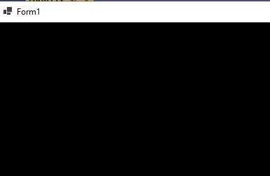

## MenuDraw

- lees de uitleg hieronder:
```
We hebben een applicatie, en in Form1.cs staan een aantal menuitems (class GameMenuItem)
die willen we tekenen op het scherm
```


- open de solution `MenuDraw.sln`

- run de application:
    > 
    - je ziet nu nog iets
    - wat we gaan maken is:
    > 
        


## 1)

- open `Form1.cs`
- zoek:
    - //1) 
        -  maak daar een for loop, die over menu loopt
            > Hint: gebruik .Length van menu

## 2)

- zoek:
    - //2) haal de // weg zodat de code gaat werken

## klaar

- commit & push naar je github        