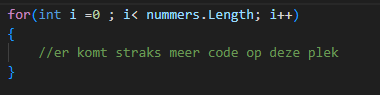
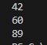
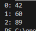

## start 


- maak in de `M1Prog_cs1`  een nieuwe directory:
    - `06_loops`
- maak in die directory een nieuwe directory:
    - `basicloop`

## loop

- lees:
    ```
    wat is een loop?

    een loop een manier om door een array heen te 'lopen' en een stuk code uit te voeren voor elk item
    - bijvoorbeeld:
        - zet elk item op het scherm
        - voer voor elk item een berekening uit

    - je hoeft niet voor elk item iets te doen, vaak zie je ook if en else in een loop
        - voorbeeld:
            - voor elk monster TEST of die in de explosie staat en doe dan schade
    ```

- laten we dat proberen, begin met het maken van een int array met 3 items
    - noem de array `nummers`

- maak nu deze code na:
    > 

- lees:
    ```
    deze code gaat voor elk van de 3 nummers iets doen, op de plek met groene tekst
    ```

- op de plek van de groene tekst, maak je code die [i] uit de array haalt en in een tijdelijke variabel stopt
    > hint kijk in de oefeningen van vorige week

- schrijf nu het nummer naar het scherm:
    > 

- zorg nu dat de index er ook bij komt staan:
    > 

## Klaar?

- git add .
- commit naar je repo voor dit vak
