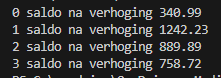

    
## start

- ga naar je deze directory in je terminal van visual studio code::
    - `06_loops`
- maak in die directory een nieuwe directory:
    - `arraycalc`

## array maken

- maak nu een array van het type double
    - noem die saldo
- zet daar 4 salo's van bankrekeningen in:
    ```
    240.99
    1142.23
    789.89
    658.72
    ```

## for loop, +100 euro!

- maak een forloop net als in de vorige oefening
- in de body van de for loop (tussen de {}) tel je 100 op bij het huidige saldo

- maak dan een tweede forloop
    - zet nu de saldo's op het scherm:
        > 

## Klaar?

- git add .
- commit naar je repo voor dit vak
