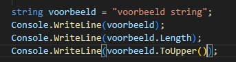
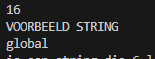
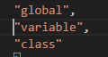
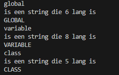

    
## start

- ga naar je deze directory in je terminal van visual studio code::
    - `06_loops`
- maak in die directory een nieuwe directory:
    - `stringclass`


## class

- lees:
    ```
    Strings zijn ook een class, we gaan nu strings als class in een array gebruiken als intro

    - dat betekent dat je met de . ineens bij eigenschappen en functies kan
    - strings hebben een .Length property waarmee je bij de lengte kan
    - ook hebben ze een .ToUpper() en .ToLower() om naar CAPS of geencaps te gaan
    
    ```

- bekijk deze code, die heb je later nodig
    > 
    - probeer deze code uit
        - je krijgt dan
            > 
        - bedenk je hoe dit werkt

## string array

- maak een nieuwe string array
    - noem deze geenCaps
    - met deze waardes:
        > 


## loop

- loop nu over de geenCaps array
    - zet het woord op het scherm
    - zet de lengte op het scherm
    - en maak er een UPPERCASE woord van en zet die op het scherm
    > HINT: elke [i] is een string variable, vanaf dat punt werkt die zoals het voorbeeld

- test, je zou dit moeten krijgen:
    > 

## Klaar?

- git add .
- commit naar je repo voor dit vak
