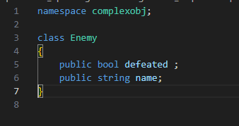
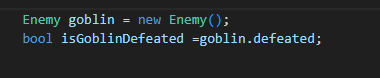
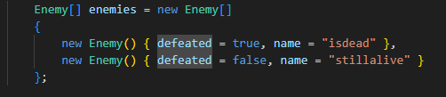
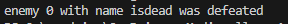
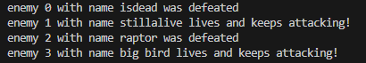

    
## start

- ga naar je deze directory in je terminal van visual studio code::
    - `06_loops`
- maak in die directory een nieuwe directory:
    - `complexobj`

## class

- maak een nieuwe .cs file:
    - Enemy.cs
    - zorg dat deze in dezelfde map als Program.cs staat

- zet daar deze code in:
    > 

## net als string, even begrijpen
- lees:
    ```
    deze enemy werkt zoals de string class
    - met . kan je bij defeated en name
    - als je een variable hebt van het type enemy met bijvoorbeeld de variabelnaam goblin:
        > goblin.defeated
    ```

- bekijk en begrijp dit voorbeel:
    > 

## loop

- maak deze array na, in Program.cs:
    > 


- maak een for loop over enemies
    - als een enemy defeated = true heeft dan:
        -gebruik je een Console.WriteLine waar je de name laat zien en dat deze defeated is

## test
 - dit moet het resultaat zijn, test dit!
    > 

- maak er nog 2 enemies bij
- laat nu ook de levende enemies zien
    > 

## Klaar?

- git add .
- commit naar je repo voor dit vak
