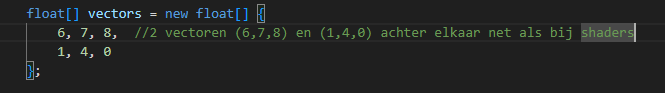
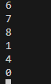
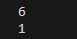
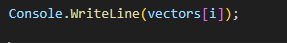
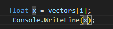
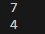
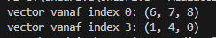

    
## start

- ga naar je deze directory in je terminal van visual studio code::
    - `06_loops`
- maak in die directory een nieuwe directory:
    - `stappen`

## array maken

- maak deze array na:
    > 

## loop

- maak een loop over vectors
    - deze mag eerst normaal zijn:
        > 
    
- lees:
```
wij willen de vectoren zien, dat zijn groepen van 3
- wij kunnen dit doen door met stappen van 3 door de array to lopen

- je past dan de i++ aan
```

## stap van 3

- zorg dat je niet i++ (i plus 1) maar i += drie doet
    - test je code je krijgt nu dit:
        >   
        > dit is alleen de X waarde, dat klopt voor nu

## andere dan x

- we herschrijven de code, je hebt iets als:
    >   
    - maar dat kan je ook schrijven als:    
        >  

- pas nu eens de i aan door er 1 bij op te tellen:
    > [i+1]

- test:  
    >  
- lees:
    ``` 
    nu hebben we de Y te pakken
    - wat moet je doen om bij de Z te komen?
    ```

## x, y, z

- zorg nu dat je alles wat je boven geleerd hebt gebruikt om x,y en z zo op het scherm te zetten:
    >  

## out of bounds

- zet nu 1 extra getal in de array
    - test
        - waarom gaat dit fout?
        - maak het werkend zonder dat getal weg te halen
            > HINT: je mag wel getallen erbij zetten
## Klaar?

- git add .
- commit naar je repo voor dit vak
