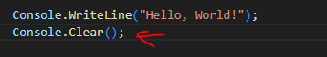
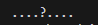
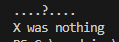
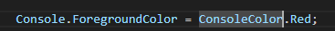
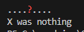

## start 


- maak in de `M1Prog_cs1`  een nieuwe directory:
    - `07_func_use`
- maak in die directory een nieuwe directory:
    - `funccall`

## function uitleg

- lees:
    ```
    wat is een function?
    - dat is een stuk code wat je opnieuw kan gebruiken
    - vaak hoort dat stuk code bij een class
        - zoals de ToUpper van de string class
    - elk object/variable van die class heeft dan die function

    - je roept/gebruikt een function door de function naam met haakjes erachter te zetten:
        > Console.WriteLine();
        > Console.WriteLine("mario".ToUpper());
    
    - hoeveel functions gebruik je in die laatste regel?
    ```

- laten we wat console functions proberen, maak deze code na:
    > 
    - test het programma

## Write and position

- zet nu onder de clear deze string op het scherm met Write (`NIET WriteLine`)
    - "....X...."

- Gebruik nu SetCursorPosition om de cursor op de X te zetten
    > De function beschrijving: https://learn.microsoft.com/en-us/dotnet/api/system.console.setcursorposition?view=net-9.0
    - gebruik coordinaten: 4,0
    - schrijf nu met Write een ?

- test of je dit krijgt:
    > 

## kleurtjes


- zet nu onder de regel met het vraagteken:
    > 

- je kan de kleur aanpassen met:
    >   
    > https://learn.microsoft.com/en-us/dotnet/api/system.console.foregroundcolor?view=net-9.0

- gebruik nu ResetColor om het op deze manier op het scherm te krijgen:
    > 


- lees:
    ```
    We hebben nu een aantal functies van de Console class gebruikt
    - deze waren allemaal static. Dat betekent dat je Console direct kan gebruiken zonder new Console() te moeten doen
    ```

## Klaar?

- git add .
- commit naar je repo voor dit vak
