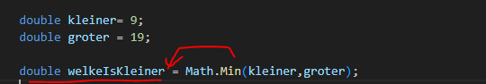
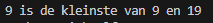
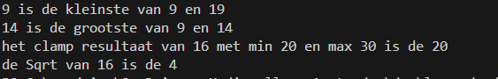

    
## start

- ga naar je deze directory in je terminal van visual studio code::
    - `07_func_use`
- maak in die directory een nieuwe directory:
    - `math`

## Math

- we gaan wat math functions gebruiken, maak dit na:
    > 
- test je code en pas aan totdat je dit hebt:
    > 

- lees:
    ```
    zie je dat je een = voor de functie kan zetten?
    - dat komt omdat Math.Min een resultaat heeft, een return zoals we dat noemen
    - een resultaat kan je in een variabel van hetzelfde type opslaan/bewaren
    ```

- maak nu zelf op dezelfde manier gebruik van deze functies van Math:
    - https://learn.microsoft.com/en-us/dotnet/api/system.math.max?view=net-9.0
    - https://learn.microsoft.com/en-us/dotnet/api/system.math.clamp?view=net-9.0
    - https://learn.microsoft.com/en-us/dotnet/api/system.math.sqrt?view=net-9.0

- test, ik kreeg dit:
    > 


## Klaar?

- git add .
- commit naar je repo voor dit vak
