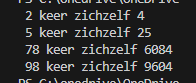

    
## start

- ga naar je deze directory in je terminal van visual studio code::
    - `07_func_use`
- maak in die directory een nieuwe directory:
    - `forfunc`
    
## array

- maak een double array met 4 verschillende getallen
    - noem deze basis

- loop over deze array

- haal het getal eruit, bewaar deze in een tijdelijke variable in de body {} van de loop

## Math.pow
- lees:
    > we gaan nu het getal keer zichzelf doen, dus tot de macht(power) 2
    - gebruik de Math class en de function Pow (https://learn.microsoft.com/en-us/dotnet/api/system.math.pow?view=net-9.0)
        - zet het resultaat op het scherm op deze manier:
            > 

## Klaar?

- git add .
- commit naar je repo voor dit vak
