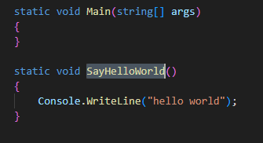
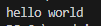
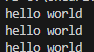
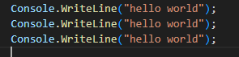

    
## start

- ga naar je deze directory in je terminal van visual studio code::
    - `07_func_use`
- maak in die directory een nieuwe directory:
    - `staticfunc`
    
## static

- lees:
    ```
    Math.Pow en Console.WriteLine zijn static functions
    Pow is van de Math class, WriteLine van Console 

    Wij gaan nu een aantal static functions op Program maken
    - normaal gebruiken wij niet zo heel vaak static, maar voor de andere variant missen jullie nog wat kennis
    dat komt later
    ``` 

- maak deze code na in Program.cs:
    > 

- Nu willen we deze function in Main gebruiken bedenk je hoe dat kan en doe dat!
    > hoe deed je dat met Math en Console?
- test en je krijgt dit:
    > 

## herhaal!

- zorg nu dat je dit krijgt, gebruik de function 3 keer:
    > 

- dat is hetzelfde resultaat als deze code:
    > 

## Meer regels

- lees:
```
waarom niet 3 keer console doen dan? Dat ligt aan de code.
Stel dat iemand de welkomst boodschap nu aanpast, dan zie je de efficientie van een function
```
- de welkomst boodschap wordt nu, vervang de hello world code met deze:
    ```Csharp
        Console.WriteLine("A long time ago in a galaxy far, far away...");
        Console.WriteLine("");
        Console.WriteLine("It is a period of civil war.");
        Console.WriteLine("Rebel spaceships, striking from a hidden base,");
        Console.WriteLine("have won their first victory against the evil Galactic Empire.");
        Console.WriteLine("");

        Console.WriteLine("During the battle, Rebel spies managed to steal secret plans");
        Console.WriteLine("to the Empire's ultimate weapon, the DEATH STAR,");
        Console.WriteLine("an armored space station with enough power to destroy an entire planet.");
        Console.WriteLine("");

        Console.WriteLine("Pursued by the Empire's sinister agents,");
        Console.WriteLine("Princess Leia races home aboard her starship,");
        Console.WriteLine("custodian of the stolen plans that can save her people");
        Console.WriteLine("and restore freedom to the galaxy...");
    ```

- test je code, krijg je 3 keer dezelfde text?

- denk na over:
    - wat als je dit zo zonder functions doet en het 2 of meerdere keren moet tonen?
    - wat als je een fout maakt, welke van de 2 manieren is dan sneller en minder werk?

## simple app


- we gaan de app uitbreiden, maak 3 nieuwe functions met de namen:
    - StopApp
    - AfterIntro
    - RestartApp


- zet 2 van de SayHelloWorld aanroepen in main even in commentaar
    > Hint: //commentaarcode
- in AfterIntro gebruik je een ReadLine and een if om het volgende te doen:
   
    - Je vraagt de gebruiker of die de intro nog een keer wil zien of wil stoppen (y/n)
        - dat doe je met deze zin:
            > Would you like to see the intro again? (y/n)
    - als de gebruiker nog een keer wil roep je RestartApp aan
    - als de gebruiker wil stoppen roep je StopApp aan
   

    
- in StopApp laat je de volgende zin zien:
    > Thank you, the app wil close now

    
- in RestartApp roep je SayHelloWorld aan

- in SayHelloWorld, roepen we AfterIntro aan

## test

- test je app en beide code paden (n en y opties)

## Klaar?

- git add .
- commit naar je repo voor dit vak
