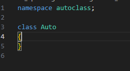
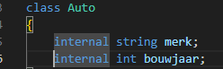

## start 


- maak in de `M1Prog_cs1`  een nieuwe directory:
    - `08_class_intro`
- maak in die directory een nieuwe directory:
    - `autoclass`

## nieuw project 

- maak een nieuw console project in de autoclass directory

## nieuwe class
- maak met deze stappen nu een nieuwe .cs file:
    - kopieer voor nu de Program.cs file
    - rename die naar Auto.cs
    - zet dit erin:
        >

- lees
```
elke class heeft zijn eigen file, let op dat de namespace hetzelfde is!
```
## fields maken

- lees:
```
classes kunnen functions en eigenschappen (fields) hebben. 
functions is WAT de class kan doen
eigenschappen is WAT de class heeft
> bv een studenten heeft een leeftijd
```

- pas je class aan zodat de velden merk en bouwjaar erbij komen:
        >

## Klaar?

- git add .
- commit naar je repo voor dit vak
