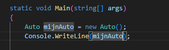
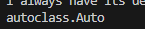
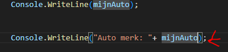
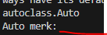
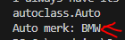
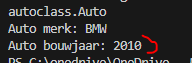
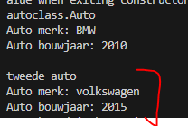

## start 


- open je Program.cs van je autoclass project
    - `autoclass`

## Instances

- lees:
    ```
    - Je hebt nu een Auto class, dit beschrijft een auto. 
    - Als je 10 auto's hebt, kunnen deze verschillende merken en bouwjaren hebben. Elke auto noemen we een Instance
    - als we een Auto in code willen gebruiken moeten we eerst:
        - een Instance maken met new
        - de Instance in een variabel van het type Auto bewaren
    ```

- maak dit na in Program.cs:
    >

- test en run je programma:
    >
- lees:
    ```
    - we hebben nu de variabel mijnAuto
    - het type daarvan is Auto
    - een auto variabel op het scherm zetten geeft alleen de namespace.classname weer. NIET de fields
    ```


## Fields tonen

- type nu onder de Console.WriteLine:
    >
- achter de mijnAuto type je nu een `.`
    - zet daar nu `merk` achter

- run!:
    - het merk is leeg? dat klopt!
    >

## merk vullen

- onder de new zet je nu:
    > mijnAuto.merk = "BMW";
- run!
    - nu is het merk niet meer leeg
        >

## bouwjaar vullen

- vul en toon bouwjaar nu op het scherm
    >

## tweede auto

- maak een tweede auto aan en zet  die op het scherm
    >


## Klaar?

- git add .
- commit naar je repo voor dit vak
