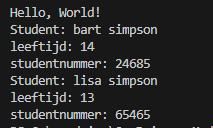

## start 

- maak in de `M1Prog_cs1`  een nieuwe directory:
    - `08_class_intro`
- maak in die directory een nieuwe directory:
    - `student`

## Instances

- maak nu zelf een student class met de fields:
    - naam
    - leeftijd
    - studentnummer
- kijk goed naar welke types je gebruikt!

- maak twee studenten en zet die op het scherm

- test en run je programma:
    >

## Klaar?

- git add .
- commit naar je repo voor dit vak
