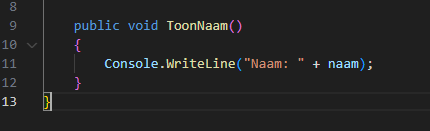
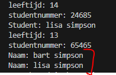
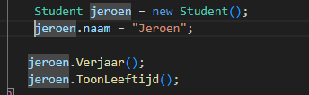
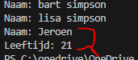

## start 

- ga verder met je project
    - `student`

## Instances

- in Student.cs maak je nu aan het eind:
    >

- in Program.cs probeer je de ToonNaam function te gebruiken.
    - doe dit ONDER in main, NA alle eerdere code
    > HINT dit lijkt op auto.merk, maar dan is het een function ()

- test en run je programma:
    >

## Verjaar

- maak nu zelf een function in Student:
    - noem die Verjaar
    - leeftijd++ in de body

- maak nu zelf een function in Student:
    - Toon leeftijd

- zet in Program.cs:
    >
    - hoe oud is jeroen? run je programma
        - waarom is jeroen zo jong?
        - verbeter het zorg dat jeroen 20 is en 21 wordt
        - toon ook de naam met de function
            >

        
## Klaar?

- git add .
- commit naar je repo voor dit vak
