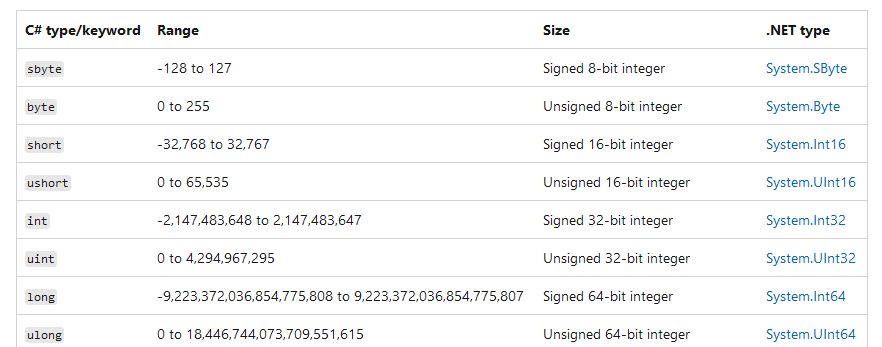
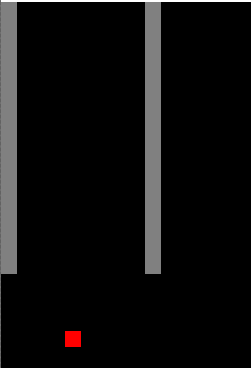

## UpAndDown

- lees de uitleg hieronder:
```
We hebben nu een game waar de speler valt, de speler valt buiten beeld
in oude games zag je vaak dat een speler dan weer bovenaan kwam te staan

dat had te maken met het datatype van de positie

```
> 

https://learn.microsoft.com/en-us/dotnet/csharp/language-reference/builtin-types/integral-numeric-types


- open de solution `UpAndDown.sln`

- run de application:
    > 
    - druk nu op spatie:
    > 


## 1)

                //1) tel hieronder 1 bij de score op
            }
            if (e.KeyCode == Keys.E)
            {
                //2) tel hieronder 5 bij de score op
            }
            if (e.KeyCode == Keys.W)
            {
                //3) tel hier zelf iets bij de score op
            }
            if (e.KeyCode == Keys.Delete)
            {
                //4) haal hieronder iets van de score af
- open `Form1.cs`
- zoek:
    - //1) 
        - maak daaronder een variable:
            - type: int
            - naam: ground
            - met de waarde van 7 keer size

## 2)

- open `Form1.cs`
- zoek:
    - //2) 
        - maak daaronder een variable:
            - type: float
            - naam: playerBottom
            - met de waarde van player.y plus size
  
## 3)

- open `Form1.cs`
- zoek:
    - //3)           
        - gebruik een If om te kijken of de playerBottom < ground
            - dan mag je de player bewegen, anders niet!
                - gebruik daarvoor de code die er al stond 
                > die code komt dus tussen de {} van de if

## testen

- start de applicatie op
- druk op spatie
    - de speler beweegt
    > 

## klaar

- commit & push naar je github        