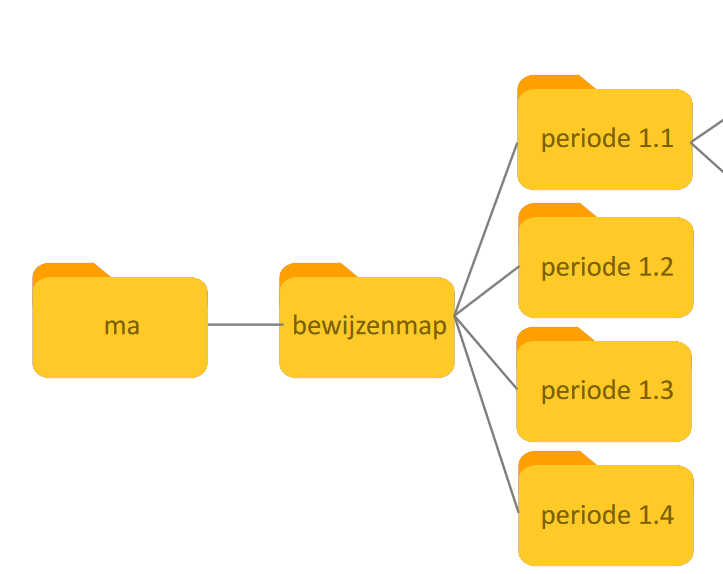
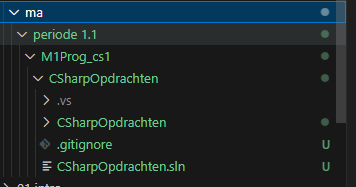

## Opslaan

- lees het onderstaande:
```
onze opgaven moeten we ergens opslaan
laten we alvast een directory (map) maken
```


## Laptop voorbereiden

- ga naar de map waar je je schoolwerk opslaat
    > HINTS:
    > -  Als het goed heet die map: `Ma`
    > -  en staat die map in je onedrive van school!
    > - 

    - Maak onder periode 1.1 een nieuwe map aan:
        - `M1Prog_cs1`
        - alles wat je doet voor dit vak moet daar in!
            - later krijg je iets als (let niet op de kleuren):
            > 