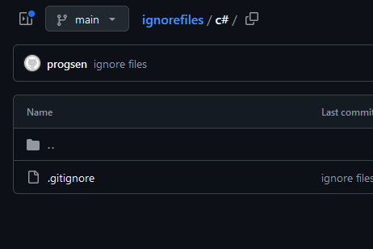
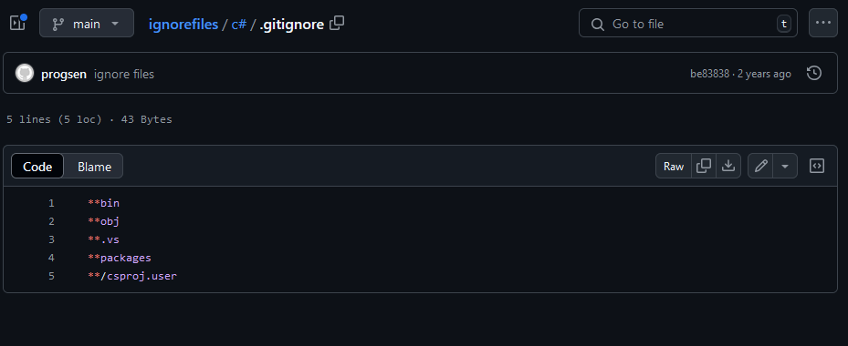
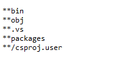
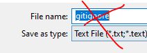
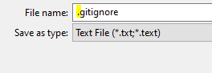
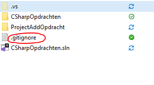

## git opzet

- lees het volgende

```
wij gaan nu ons werk LATER in git zetten.
om dat GOED te doen moeten we een ignore file voor elke solution die wij maken neerzetten. anders komt er teveel in git
```

## git ignore file downloaden

- ga in je browser naar:
    - https://github.com/progsen/ignorefiles/tree/main/c%23
    - je ziet:
        >

## hoe moet ik deze downloaden?
- click op de .gitignore, je ziet nu:

    >
- click op raw, je ziet nu:
    >
- druk CTRL-S, je ziet nu een opslag dialoog:
    - alleen de filename is verkeerd:
    >
    - zet er een punt voor:
    >


- zet nu je `CSharpOpdrachten` directory in de `M1Prog_cs1` directory
    - naast je `CSharpOpdrachten.sln` file
    - controlleer of het er nu zo uitziet:

    >


